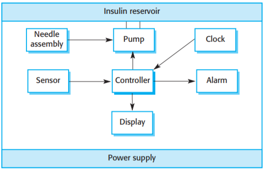
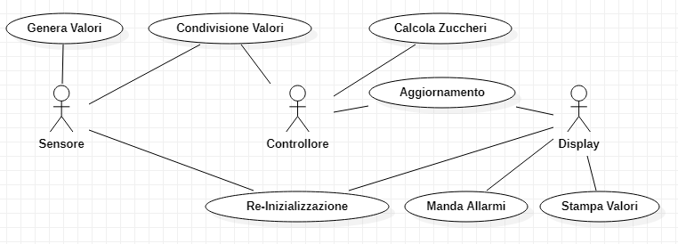
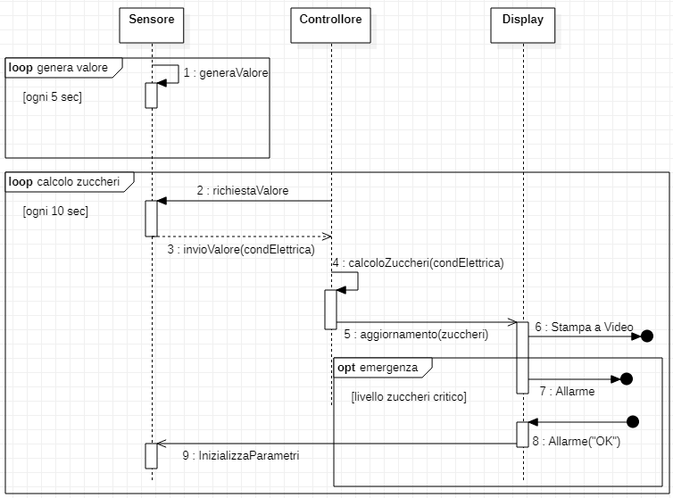
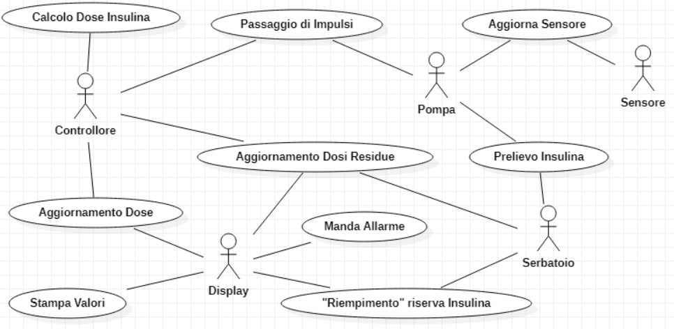
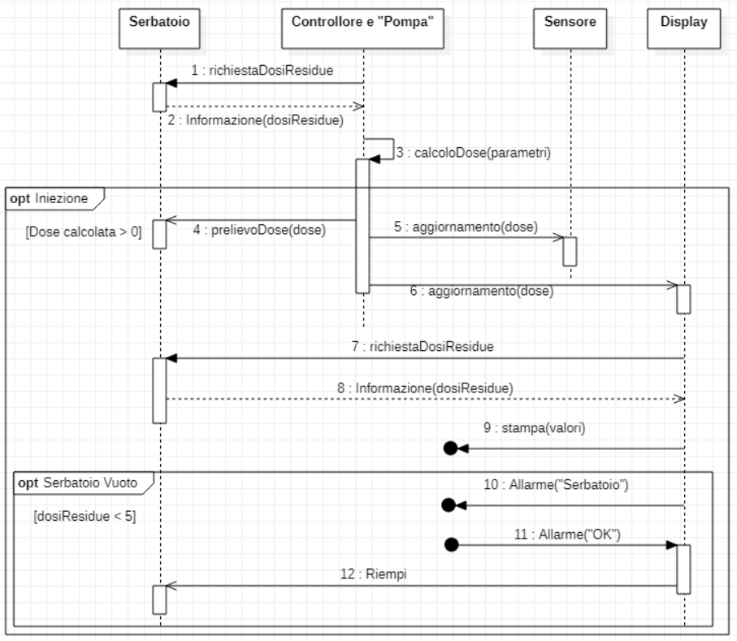
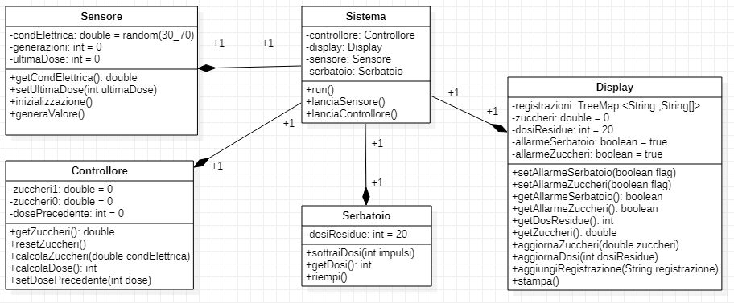
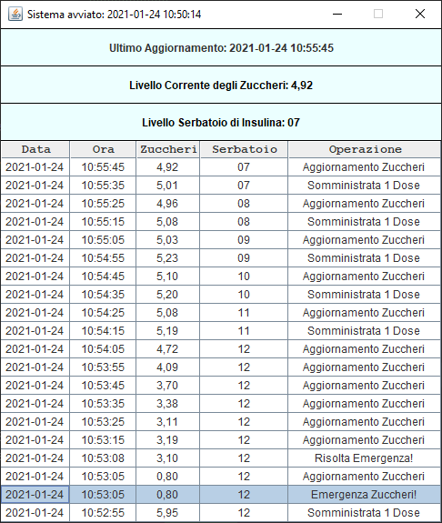

# Sistema di Controllo di una Pompa di Insulina

## Descrizione del Sistema:

Una pompa di Insulina è un sistema medico che simula il funzionamento del pancreas.
Il software che controlla questo sistema riceve informazioni da un sensore e controlla una pompa che rilascia una dose di insulina a un paziente (per il trattamento di persone diabetiche).

Il sensore misura la conducibilità elettrica del sangue e i valori ottenuti permettono di stimare il livello degli zuccheri.
La pompa rilascia un'unità di insulina per ogni impulso ricevuto dal sistema, che deve aver calcolato correttamente la dose necessaria.

Chiaramente, il sistema ha sicurezza critica. Se qualcosa si guasta, il paziente può subire gravi danni.
Pertanto, il sistema deve soddisfare i seguenti requisiti di alto livello:
- disponibilità a somministrare l'insulina quando richiesta.
- comportamento affidabile e fornitura corretta dell'insulina.

Nell'immagine si vedono tutte le componenti del sistema:
- Il sensore mantiene la misurazione dei parametri richiesti, che verranno letti dal controllore.
- La pompa di insulina, quando riceve un'istruzione dal  controllore, preleva la giusta dose dal serbatoio e la inietta attraverso l'ago.
- Il serbatioio è anch'esso dotato di un sensore, grazie al quale è possibile monitorare la quantità di insulina residua, e provvedere a sostituirla.
- L'allarme può essere attivato dal controllore in caso di malfunzionamenti rilevati.
- L'orologio è usato dal controllore per monitorare i tempi tra un'iniezione e la successiva, ed è utile al calcolo delle dosi.
- Il display permette di visualizzare in forma tabellare le informazioni sulle iniezioni. In particolare, vengono inseriti i livelli stimati di zuccheri nel sangue, le dosi iniettate al paziente e i livelli di insulina nel serbatoio.

**Nota:** quella raffigurata nell'immagine è la descrizione del sistema reale. Lo scopo della progettazione è lo sviluppo di un controllore funzionante, pertanto i componenti hardware saranno solamente simulati.

## Scenari

### 1. Livello degli zuccheri nella zona sicura.

- **Ipotesi Iniziale:** Il controllore legge il parametro del sensore.
- **Svolgimento Normale:** Il controllore calcola un livello degli zuccheri in zona sicura e procede a calcolare la dose di insulina da fornire al paziente (questo potrebbe produrre anche la decisione di non fornire insulina al paziente).
In caso di dose calcolata maggiore di 0 il sistema procede fornendo alla pompa il numero di impulsi necessari (un impulso equivale ad una dose di insulina).
La pompa pertanto inietta al paziente l'insulina, prelevandola dal serbatoio.
- **Possibili altre situazioni:** Il controllore potrebbe decidere che non è necessario fornire insulina. In questo caso lo scenario si conclude subito dopo aver aggiornato il display con il nuovo livello degli zuccheri.
Potrebbe inoltre accadere che la dose calcolata sia maggiore delle dosi residue nel serbatoio. In questo caso si inietta il massimo quantitativo di insulina possibile, ossia tutta quella rimasta nel serbatoio. 
- **Stato del sistema al completamento:**
Il controllore aggiorna il display con il nuovo valore degli zuccheri e le eventuali misure di insulina fornite, aggiornando anche il livello corrente di insulina nel serbatoio.

### 2. Insulina nel serbatoio sotto la soglia minima.

- **Ipotesi Iniziale:** A seguito di un'iniezione, l'insulina nel serbatoio è scesa sotto la soglia minima, cioè sotto alla quantità massima iniettabile in una dose.
- **Svolgimento Normale:** Sul Display l'informazione riguardante le dosi residue diventa scritta in rosso, e parte l'allarme.
- **Possibili altre situazioni:** Se il serbatoio non viene riempito in fretta il sistema non potrà più iniettare insulina, causando un lento ma inesorabile aumento degli zuccheri nel sangue.
- **Stato del sistema al completamento:**
Lo scenario si completa solo con l'intervento dell'operatore, che sente l'allarme e procede a riempire il serbatoio.
Quando il serbatoio è pieno, l'allarme si spegne e sul display la scritta torna del colore originale.
L'operazione viene inoltre registrata sul display.

### 3. Livello degli zuccheri molto basso.

- **Ipotesi Iniziale:** Il controllore calcola un valore degli zuccheri sotto la soglia sicura.
- **Svolgimento:** Il verificarsi di questo scenario indica un'eccessiva somministrazione di insulina, cosa che non dovrebbe mai accadere se il sistema funziona correttamente. 
Pertanto lo svilupparsi di questo scenario potrebbe essere dovuto a un malfunzionamento di qualche componente del sistema, o a qualche complicazione nel paziente.
Il controllore può solamente attivare l'allarme indicando inoltre in rosso il livello degli zuccheri sul display. In nessun caso deve essere somministrata altra insulina al paziente.
- **Stato del sistema al completamento:**
L'operatore procede a risolvere l'emergenza e il sistema spegne l'allarme, registrando l'operazione sul display.

### 4. Livello degli zuccheri molto alto.

- **Ipotesi Iniziale:** Il controllore calcola un livello degli zuccheri sopra la soglia sicura.
- **Svolgimento Normale:** 
Il sistema inietta la dose massima di insulina permessa e attiva l'allarme, segnando il livello degli zuccheri in rosso e notificando l'iniezione sul display.
- **Possibili altre situazioni:** Il controllore potrebbe calcolare che la dose massima iniettabile è zero (se il serbatoio è vuoto, o se è appena stata effettuata un'iniezione). In questo caso, l'unico comportamento attuabile è l'aggiornamento del display e l'attivazione dell'allarme. 
- **Stato del sistema al completamento:**
L'operatore può intervenire per controllare la situazione, in caso di complicazioni nel paziente. Tuttavia il livello degli zuccheri potrebbe tornare alla normalità anche autonomamente, se l'iniezione di insulina farà effetto.
In ogni caso, l'allarme si spegne solo con l'intervento dell'operatore. Viene inoltre registrata sul display tutta l'operazione.

### 5. Routine di Auto Test.

- **Ipotesi Iniziale:** Ogni minuto il sistema lancia una routine per testare il sistema.
- **Svolgimento Normale:** Il sistema svolge la routine per cercare eventuali malfunzionamenti hardware, ad esempio nella pompa o nei sensori. 
- **Possibili altre situazioni:** Il sistema potrebbe trovare dei malfunzionamenti, in questo caso sospende le sue attività e attiva l'allarme, mandando un apposito messaggio sul display.
- **Stato del sistema al completamento:**
Se non ci sono problemi, il sistema continua la sua normale attività.

### Osservazione Finale

Tutti gli scenari appena visti appartengono al sistema reale. 

Nell'implementazione del sistema è stato progettato un  controllore che esegue tutte le funzionalità sopra descritte, tranne la routine di autotest (in quanto essa andrebbe svolta sui componenti hardware, che sono soltanto simulati).

Inoltre, è stata progettata anche una versione minimale (ma perfettamente funzionante) del display.

## Casi D'Uso e Diagrammi di Sequenza basati sui Requisiti

### Interazioni tra Sensore e Controllore per il calcolo del livello degli zuccheri

1. Il sensore del sangue simulato genera il livello di conducibilità elettrica ogni 5 secondi, e il controllore legge tale valore ogni 10 secondi. Nei casi reali, questo procedimento sarebbe molto più lento (ogni 10 minuti). Il numero generato dal sensore rappresenta la conducibilità elettrica del sangue di un ipotetico paziente e non è casuale, ma tiene conte della precedente dose somministrata e del precedente valore generato.

2. Il controllore deve poi calcolare il nuovo livello degli zuccheri ed aggiornare il display.
Se il livello degli zuccheri è critico, il sistema manda l'allarme come specificato negli scenari 3. e 4. (nel sistema implementato tale compito è riservato al display).
Un livello degli zuccheri è considerato nella norma se il suo valore è tra 3 e 7.
Se il livello calcolato è 0 o 10, ciò implica la perdita del paziente. Pertanto, in questi casi il sensore smetterà di generare i valori.
Le emergenze sui livelli degli zuccheri vengono "risolte" con la conferma di visualizzazione del messaggio di allarme sul display. Questo produrrà una nuova inizializzazione dei valori generati dal sensore.

### Interazioni tra Controllore e "Pompa" per l'iniezione dell'insulina

3. Dopo aver calcolato gli zuccheri e aggiornato il display, il controllore procede a calcolare l'eventuale dose di insulina da somministrare. Se il livello degli zuccheri era alto (maggiore di 7), il controllore calcola la massima dose di insulina che può iniettare, basandosi sui tempi e la quantità della precedente iniezione.
Se invece il livello è nella norma, il controllore calcola la dose basandosi anche sui valori degli zuccheri precedenti, e può decidere di non somministrare alcuna dose.
In questi calcoli il controllore tiene conto anche delle dosi residue nel serbatoio, e non manda mai alla pompa ordine di somministrare più dosi di quelle presenti.

4. Se il controllore ha calcolato che è necessario somministrare almeno una dose, il sistema procede a farlo. Inoltre, verrà aggiornato il display registrando l'operazione.
Nel sistema implementato la pompa viene simulata direttamente dal controllore e il suo comportamento si può riassumere nelle due operazioni:
    - Sottrai la dose di insulina corretta dal serbatoio
    - Aggiorna il sensore del sangue sulla dose somministrata, simulando l'iniezione (servirà al sensore per generare i successivi valori).

### Interazioni tra Display e Serbatoio per il mantenimento della riserva di Insulina

5. Nei casi reali il serbatoio è dotato di sensore, che manda informazioni sulla quantità residua di insulina al sistema. 
Pertanto, dopo che il display riceve dal controllore l'aggiornamento sulla dose somministrata, controlla quante dosi rimangono nel serbatoio e aggiorna anche questo valore; procedendo a stampare tutte le nuove informazioni. 

6. Se a seguito di un'iniezione, il sensore rileva che nel serbatoio rimane insulina sotto la soglia minima di 5 dosi, il display procede ad attivare l'allarme, segnando inoltre con scritta rossa il numero di dosi rimaste nel serbatoio.
Anche questa emergenza viene "risolta" visualizzando l'ok sul display, che produrrà un riempimento del serbatoio.

#### Casi D'Uso e Diagrammi di Sequenza per i punti da 3 a 6

### Altri Requisiti

7. Sul display sono sempre presenti in forma tabellare e associate all'orario le ultime 20 operazioni effettuate dal sistema.
Queste comportano i cambiamenti rilevati dei livelli di zuccheri nel sangue, le dosi di insulina fornite e altre operazioni quali il riempimento del serbatoio e la risoluzione delle emergenze. 
Sul display inoltre sono sempre presenti il livello attuale degli zuccheri del paziente e il livello attuale di insulina nel serbatoio.

## Diagramma di Classe e Panoramica sul Sistema

### Sistema

All'avvio dell'applicazione viene creato un oggetto di tipo Sistema, che ha il compito di mantenere e gestire tutte le altre componenti.

In particolare, per simulare il comportamento del sensore e del controllore viene utilizzata la programmazione multithread.
Di conseguenza, i due metodi "lanciaSensore" e "lanciaControllore" avviano due differenti thread, che trovano nel metodo "run" il loro svolgimento.

Se è il Thread-Sensore a lanciare il metodo "run", esso entrerà un ciclo potenzialmente infinito, che si ripete ogni 5 secondi. In questo ciclo, si utilizza l'oggetto "Sensore" per generare un nuovo valore della conducibilità elettrica.

Il Thread si interrompe solamente se l'applicazione viene chiusa o se viene generato un valore pari a 0 o 100 (implicante la "morte" del paziente).

Se è il Thread-Controllore a lanciare il metodo "run", allora si entra nel ciclo principale del programma, che si ripete ogni 10 secondi e si interrompe solo in caso di "morte" del paziente o di chiusura dell'applicazione.

In breve, durante un ciclo si utilizzano gli oggetti "controllore" e "serbatoio" per svolgere le seguenti operazioni:

1. Calcolo del nuovo livello degli zuccheri e aggiornamento del valore corrispondente nella classe "display", utilizzando gli appositi metodi.

2. Calcolo della dose da somminsitrare, tenendo anche conto delle dosi residue nel serbatoio, e non prelevandone quindi mai più di quella effettivamente disponibile. Aggiornamento dell'attributo del controllore "dosePrecedente".

3. Se la dose calcolata è maggiore di 0, simulazione del comportamento della pompa, facendo l'"iniezione". Questa consiste nel sottrarre le dosi corrette dal serbatoio e nell' aggiornare il valore "ultimaDose" del sensore. Si aggiorna inoltre il valore "dosiResidue" del display registrando anche che vi è stata un'iniezione.

4. Si lancia un nuovo Thread, il "Thread-Display", che eseguirà anch'esso il metodo "run".

Il Thread-Display (creato per non interrompere lo svolgimento del ciclo del Thread-Controllore), si occupa per prima cosa di lanciare il metodo "stampa" del Display, che aggiorna a video tutti i valori cambiati negli ultimi 10 secondi.

L'altro importante compito di questo Thread, è il lancio e la gestione delle emergenze.

Il primo controllo che viene effettuato è sulla "morte" del paziente. In tal caso, non si effettuano altre operazioni, ma si stampa un semplice messaggio a video, informando l'utente.

Se invece il paziente è ancora vivo, si eseguono dei check sul serbatoio e sugli zuccheri.

Il primo stampa un messaggio che permette all'utente di riempire il serbatoio, e dopo la sua visualizzazione viene lanciato il metodo "riempi" di tale classe.

Per quanto riguarda gli zuccheri, anche in questo caso viene stampato un messaggio a video avvisando l'utente dell'emergenza.
Dopo la visualizzazione, vengono lanciati i metodi "inizializza" del sensore e "resetZuccheri" del controllore, che riazzerano la generazione dei valori.

### Sensore

Il sensore calcola la conducibilità elettrica nel sangue in diverse condizioni, e questo valore è proporzionale al livello degli zuccheri.
In particolare, si è supposto che la conducibilità elettrica è un valore compreso tra 0 e 100, mentre il livello degli zuccheri è tra 0 e 10, calcolato dividendo il parametro del sensore per 10.

Si è supposto inoltre che dei valori stabili della conducibilità Elettrica (e quindi degli zuccheri) siano tra 30 e 70, e infatti a un tale valore casuale viene inizializzato il sensore.

Nei casi reali, il controllore legge il valore del sensore ogni 10 minuti (i cambi nei valori degli zuccheri sono relativamente lenti). Ai fini del progetto, questa lettura avviene ogni 10 secondi.

Il sensore è implementato attraverso una classe che si occupa di generare casualmente dei valori per la conducibilità elettrica. Questi valori sono generati ogni 5 secondi.

Per non rendere la generazione del valore completamente casuale, e dunque tentare di simulare il comportamento reale di un paziente, il sensore terrà conto della quantità e tempistica dell'ultima dose di insulina somministrata.

Indicativamente, quando viene somministrata una dose di insulina, i livelli degli zuccheri dovrebbero scendere, e cominiciare a rialzarsi dopo un po' di tempo.

Per la funzione "generaValore", si è deciso di procedere nel seguente modo:

- definiamo il parametro *t* (attributo "generazioni") come il numero di generazioni passate dall'ultima dose (per generazione si intende quella dei valori, quindi ogni 5s ne passa una).
- definiamo il parametro *d* (attributo "ultimaDose") come il numero di dosi somministrate all'ultima iniezione (tra 1 e 5)

1. All'inizio di ogni chiamata passa una generazione, dunque "*t = t + 1*".
2. I limiti dei valori sono 0 e 100.
3. Finché *d > t* il numero generato deve scendere.
4. Altrimenti il numero scende con probabilità *d/t*, e sale negli altri casi.
4. Quando il livello scende, lo fa di una quantità casuale tra 0 e *2d/t*.
5. Quando il livello sale, lo fa di una quantità casuale tra 0 e *t/2d+1*.
6. Infine, vi è sempre una possibilità del 2% che il numero generato sia completamete casuale (per simulare eventuali complicazioni improvvise).

### Serbatoio
La classe serbatoio ha un solo attributo, che può assumere valori tra 0 e 20. Esso rappresenta la quantità residua di dosi nel serbatoio stesso, che può essere opportunamente riempito.

Il comportamento di questa componenete è gestito totalmente dal Thread-Controllore, che si occupa di controllare e sottrarre le dosi giuste.

Inoltre, la funzione "riempi" viene lanciata solo dal Thread-Display, dopo aver ricevuto l'"ok" dall'utente. Questo simula il riempimento "reale" del serbatoio da parte di un operatore.

### Controllore

Questa classe implementa tutte le funzioni utili al corrispondente Thread.

I suoi 3 attributi rappresentano il livello attuale e precedente degli zuccheri e la precedente dose calcolata (può essere 0).

I due metodi interessanti sono "calcolaZuccheri" e "calcolaDose". Il primo semplicemente aggiorna i valori "zuccheri0" e "zuccheri1", grazie alla conducibiltà elettrica generata dal sensore.

Il secondo invece calcola la dose da somministrare secondo i seguenti parametri:

1. se gli zuccheri sono tra 5 e 7 e il tasso è in salita ("zuccheri1 - zuccheri0 > 0"), allora si somministrano 1 o 2 dosi (a seconda che il valore degli zuccheri sia 5.x o 6.x).

2. Se il valore degli zuccheri è critico (sopra 7), si somminstra la massima dose possibile.

3. In tutti gli altri casi, non si somministrano dosi.

4. Per non causare sovradosaggi, non si possono superare le 5 dosi ogni 20 secondi. Quindi in due cicli successivi bisogna tenere conto del valore della dose somministrata precedentemente (attributo "dosePrecedente").

### Display

Questa classe è la più ampia del sistema, in quanto implementa anche l'interfaccia grafica (esempio nell'immagine sottostante).

Tuttavia, gli attributi principali sono quelli illustrati anche nello schema delle classi.

"zuccheri" e "dosiResidue" tengono traccia dei rispettivi valori, mentre gli attributi booleani sono dei Flags utili a non visualizzare più volte lo stesso messaggio (siccome il Thread-Display viene lanciato ogni 10 secondi, se ad esempio il serbatoio è vuoto il messaggio di allarme corrispondente viene visualizzato una sola volta).

L'attributo "registrazioni" serve a stampare la tabella, e tiene traccia delle operazioni svolte e dei livelli di zuccheri e serbatoio in quel momento. 

## Test

**Nota:** Siccome i Tests fanno forzatamente uso dei Threads, essi impiegano almeno un minuto per essere svolti.

Sono state testate come Unity Test tutte le classi "aggregate" del sistema: controllore, sensore, display e serbatoio.

La soddisfacibilità dei requisiti (Acceptance Tests) è invece stata provata sulla classe Sistema, formata dall'aggregazione di tutte le altre componenti e "coordinatrice" dell'applicazione (tramite il lancio di più Threads).

Negli Unity Tests, sono stati direttamente provati i metodi principali, ma non metodi semplici quali alcuni getter e setter (che sono però stati testati "empiricamente", in quanto usati negli stessi tests). Si stima per questo una buona copertura degli Unity Tests (circa 85%), in quanto l'unica classe non totalmente coperta è il display (l'interfaccia grafica non è stata testata).

Negli Acceptance Tests, sono stati provati tutti i requisiti illustrati anche dai casi d'uso, coprendo dunque la maggior parte del sistema.

### Unity Tests

- **Serbatoio:** di questa componente sono stati testati il Costruttore, il metodo "sottraiDosi" e il metodo "riempi". In particolare, ci si è assicurati che il serbatoio venga inizializzato a 20 dosi, e che non si possano sottrarre più dosi di quelle presenti.

- **Sensore:** di questa componenete sono stati testati il Costruttore e il metodo "generaValore". In particolare, il costruttore deve inizializzare correttamente il valore della conducibilità elettrica (casualmente tra 30 e 70); e i valori generati devono sempre essere tra 0 e 100.

- **Display** in questa classe è implementata l'interfaccia grafica, che non è stata direttametne testata. Sono stati invece testati il costruttore (valori inizializzati correttamente), e la registrazione di una nuova operazione.

- **Controllore** anche qui è stata testata l'inizializzazione da parte del controllore. Ci si è poi assicurati che gli zuccheri e la dose vengano calcolati come richiesto dai requisiti (metodi calcolaZuccheri e calcolaDose).

### Acceptance Tests

Sono stati condotti test per verificare i 6 requisiti che hanno prodotto i casi d'uso (la correttezza del calcolo della dose e degli zuccheri era già stata testata tramite gli appositi metodi degli Unity Tests).

In particolare, ci si è accertati delle seguenti condizioni:

1. Il sensore genera un valore di conducibilità Elettrica ogni 5 secondi.
2. Se il valore generato è 0 o 100, il sensore smette di generare valori (morte del paziente).
3. Il controllore legge la conducibilità elettrica ogni 10 secondi e calcola il livello degli zuccheri.
4. Il controllore aggiorna il display sugli zuccheri.
5. Un livello critico degli zuccheri è tra 0 e 3 o tra 7 e 10. Questo causerà il lancio dell'emergenza.
6. L'emergenza verrà risolta con la visualizzazione del messaggio da parte dell'utente (nuova inizializzione dei valori).
7. Il controllore calcola la dose e se è meggiore di 0 procede all'iniezione.
8. L'iniezione è simulata sottraendo la dose corretta dal serbatoio e aggiornando il sensore sulla dose somministrata.
9. Dopo aver somministrato una dose, il controllore aggiorna il display.
10. Se rimangono meno di 5 dosi nel serbatoio, viene stampato il messaggio per riempirlo.